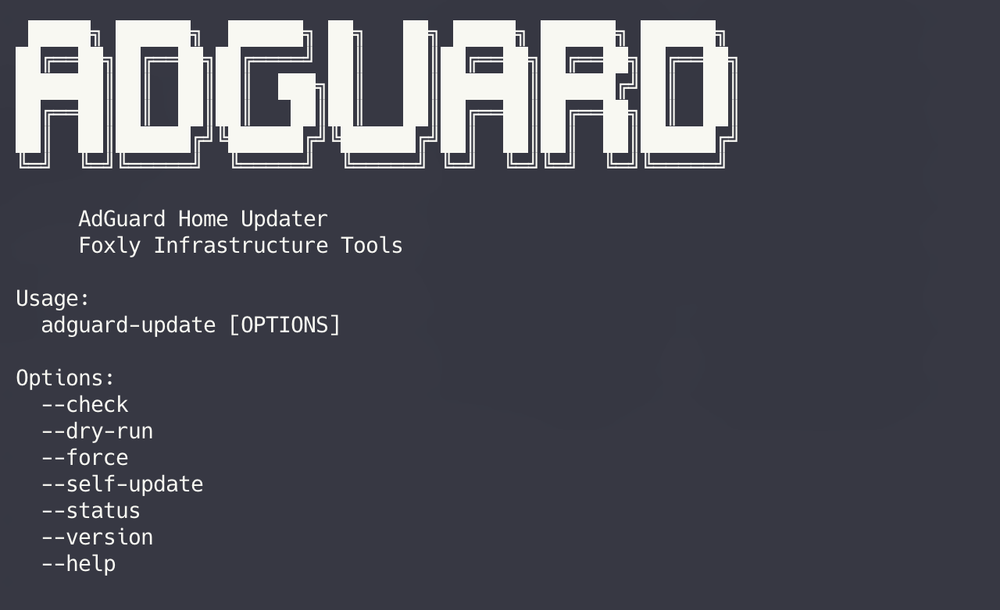

<p align="center">

</p>

# AdGuard Home Bare-Metal Updater


Safe and automated updater for **AdGuard Home bare-metal installations**.

This project provides a small but robust update utility for **AdGuard Home when installed directly on a Linux host without Docker**.

It is designed for **homelab DNS infrastructure**, where reliability matters more than flashy features.

---

# Why this project exists

AdGuard Home includes a built-in updater that works well on **amd64 systems**.

However, on many **ARM64 systems (e.g. Raspberry Pi)** the internal updater frequently fails and requests manual updates.

Typical scenario:

```
Update available
↓
Download starts
↓
Installation fails
↓
Manual update required
```

For infrastructure services like DNS this becomes annoying quickly.

This updater automates the entire process safely.

---

# CLI Preview



Example:

```bash
adguard-update --check
```

Dry-run update simulation:

```bash
sudo adguard-update --dry-run
```

---

# Quick Install

Install the updater with a **single command**:

```bash
curl -fsSL https://raw.githubusercontent.com/foxly-it/adguard-home-updater/main/install.sh | sudo bash
```

The installer will automatically:

- install `adguard-update`
- install systemd service
- optionally enable automatic updates
- verify download integrity

---

# Uninstall

Remove the updater completely:

```bash
curl -fsSL https://raw.githubusercontent.com/foxly-it/adguard-home-updater/main/install.sh | sudo bash -s uninstall
```

This removes:

- updater binary
- systemd service
- systemd timer

---

# Non-interactive Install

For automation tools like **Ansible or cloud-init**:

```bash
curl -fsSL https://raw.githubusercontent.com/foxly-it/adguard-home-updater/main/install.sh | sudo bash -s -- --no-interactive
```

---

# Quick Test (Dry-Run without installation)

Run the updater **without installing it**:

```bash
curl -fsSL https://raw.githubusercontent.com/foxly-it/adguard-home-updater/main/adguard-update | sudo bash -s -- --dry-run
```

Check if an update is available:

```bash
curl -fsSL https://raw.githubusercontent.com/foxly-it/adguard-home-updater/main/adguard-update | sudo bash -s -- --check
```

---

# Features

| Feature | Description |
|---|---|
| Architecture detection | Supports `amd64` and `arm64` |
| Automatic version check | Compares installed version with latest upstream release |
| Secure download | Verifies official SHA256 checksum |
| Binary backup | Keeps previous binary |
| Rollback protection | Restores old binary if service fails |
| Dry-run mode | Simulates full update workflow |
| Check mode | Shows if update is available |
| Force update | Reinstalls even if version matches |
| Self update | Updates the updater itself |
| DNS health check | Verifies port 53 and performs DNS query test after update |
| Lockfile protection | Prevents concurrent runs |
| Logging | Writes logs to `/var/log/adguard-update.log` |
| systemd integration | Supports automated update checks |

---

# Usage

## Status

```bash
adguard-update --status
```

---

## Check for update

```bash
adguard-update --check
```

Example output:

```
Installed version:
  0.107.72

Latest version:
  0.107.73

Status: update available
```

---

## Dry-run

Simulate the update workflow:

```bash
sudo adguard-update --dry-run
```

---

## Normal update

```bash
sudo adguard-update
```

---

## Force update

```bash
sudo adguard-update --force
```

---

## Update the updater

```bash
sudo adguard-update --self-update
```

---

# Update Workflow

```
Version Check
      ↓
Download Release
      ↓
Download SHA256 File
      ↓
Verify Checksum
      ↓
Extract Archive
      ↓
Stop AdGuard Home
      ↓
Backup Current Binary
      ↓
Install New Binary
      ↓
Start AdGuard Home
      ↓
DNS Health Check
      ↓
Rollback on Failure
```

This keeps the process **simple, auditable and safe for infrastructure services**.

---

# Logging

All activity is written to:

```
/var/log/adguard-update.log
```

Example:

```
2026-03-11 03:10:01 - Architecture detected: arm64
2026-03-11 03:10:01 - Installed version: 0.107.72
2026-03-11 03:10:01 - Latest version: 0.107.73
2026-03-11 03:10:02 - Downloading release
2026-03-11 03:10:03 - Verifying checksum
2026-03-11 03:10:04 - Installing new binary
2026-03-11 03:10:05 - Update successful
```

---

# systemd Automation

The installer can configure a **systemd timer** for automatic update checks.

Check timer status:

```bash
systemctl status adguard-update.timer
```

Manual run:

```bash
systemctl start adguard-update.service
```

List timers:

```bash
systemctl list-timers | grep adguard
```

---

# Security

The installer verifies the integrity of downloaded files using **SHA256 checksums**.

Each release includes:

```
adguard-update
adguard-update.sha256
checksums.txt
```

This protects against corrupted downloads or supply-chain attacks.

---

# Example Homelab Architecture

```
Clients
   ↓
AdGuard Home
   ↓
Unbound
   ↓
Internet DNS hierarchy
```

Updater integration:

```
AdGuard Home
     │
     └── adguard-update
           ├─ version check
           ├─ secure download
           ├─ checksum verification
           ├─ binary replacement
           └─ rollback protection
```

---

# Requirements

- Linux host
- systemd
- root privileges
- internet access

AdGuard Home installed in:

```
/opt/AdGuardHome
```

Required utilities (usually already available):

```
curl
tar
sha256sum
systemctl
ss
```

---

# Contributing

Contributions, ideas and improvements are welcome.

Please open an issue or submit a pull request.

---

# License

MIT License

---

# Disclaimer

This project is **not affiliated with AdGuard**.

Use at your own risk.